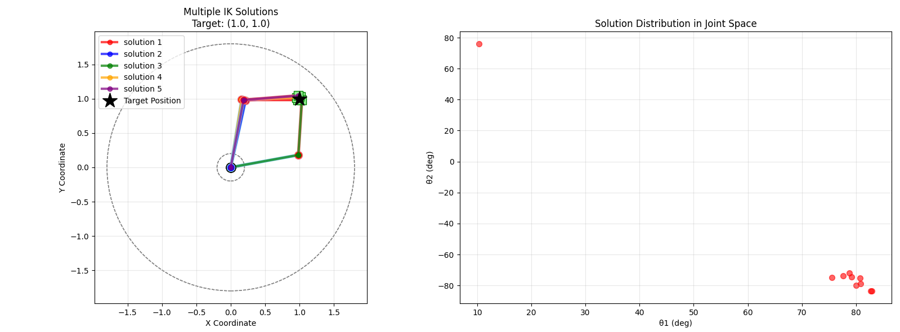

# 基于 Normalizing Flow 的逆运动学求解器

> 对于论文 [IKFlow: Generating Diverse Inverse Kinematics Solutions](https://arxiv.org/abs/2111.08933) 的简单实现，官方实现请参考 [github: IKFlow](https://github.com/jstmn/ikflow)

这个项目实现了一个基于深度生成式网络（Normalizing Flow）的二自由度平面机器人逆运动学求解器。使用条件 Real-NVP 模型学习从末端执行器位置到关节角度的复杂映射关系。


如果有 CUDA 支持的 GPU，将自动使用 GPU 加速训练。

## 🎯 快速开始

### 1. 依赖库

确保安装以下必要的库：

```bash
pip install torch torchvision numpy matplotlib
```

### 2. 运行完整演示

```bash
python demo_inverse_kinematics.py
```

这将运行三个演示：
- 基本逆运动学求解
- 多解分析
- 工作空间分析


